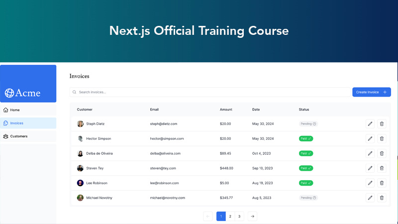

## Next.js App Router Course - Starter

This is the starter template for the Next.js App Router Course. It contains the starting code for the dashboard application.

Tools:

- [Training course curriculum](https://nextjs.org/learn) on the Next.js Website.
- [Vercel dashboard](https://vercel.com/nikkis-projects-72ca6090/nextjs-dashboard/stores/postgres/store_jOYiNXw7iy2UOPtf/data) that uses Postgres database.

### Features of Next.js

#### Create New NextJS Project

- Use `create-next-app` to create new project.
- Written in TypeScript.
- To install project packages, run `npm i`.
- Start the development server on port 3000, run `npm run dev`.
- This will open open http://localhost:3000/

#### Repo Architecture

- **config** files -> at root, webpack, babel, etc are abstracted away for simplicity
- **public** folder -> image files
- **scripts** folder -> any js scripts (like seeding postgres database)
- **app** folder -> all react files
- **app/page.tsx** -> home page associated with root at /.
- **app/layout.tsx** -> contains html and body tags and imports global css file.
- **app/ui** -> all CSS files, fonts and reusable components.
- **app/lib** -> mock data, type definitions, functions and requests.
- **app/myfirstroute** -> A nested route app/myfirstroute.
- **app/myfirstroute/layout.tsx** -> Shared components for base route and any sub-routes.

#### Next Modules

- Some of the new modules in Next.js = next/font, next/image, next/link, next/navigation, next/cache

#### CSS

- CSS files contained in **app/ui** folder.
- Global css file can be imported to top level component **app/layout.tsx**.
- Can choose any CSS solution:
  - **Tailwind CSS** is default choice - framework where you write utility classes in your file.
  - **CSS Modules** is another option - scope CSS to component using unique class names.
  - **CSS-in-JS** is another option (styled-components, emotion, etc).
  - **SASS** is another option (.css and .scss files).
- **clsx** is a library that lets you toggle classnames that have different css styles.

#### Fonts

- Use **next/font** module to automatically optimize fonts.
  - How? - font is downloaded at build time, hosts with other static assets.
  - Can use Google font - **next/font/google**
  - May have to specify a subset for google fonts.
- Apply a font to the body tag in app/layout.tsx to have default base font for application.
- Add antialiased to the body from Tailwind CSS (if using it).

#### Images

- Use **next/image** component to automatically optimize images.
- How?

  - Import Image component from next/image.
  - Apply an src value to point to image in the public folder.
    - _Static assets like images live in the **public** folder._
  - Apply width and height to avoid layout shift.
  - Use a classname as needed.

- To toggle between a desktop image and a mobile image:
  - Add desktop Image with className="hidden md:block":
    - when you want to show desktop image and hide the mobile image.
  - Add mobile Image with className="block md:hidden":
    - when you want to show mobile image but hide the desktop image.

#### Layouts and Pages

- Next uses file-system routing where folders create the **nested routes**.
- **page.tsx** is file that exports React component and required for route to be accessible.

  - app/page.tsx is the home page associated with the root page at /.
  - app/layout.tsx page is a special file that is used to share UI between multiple pages.
    - The component in this file you create would be named Layout.
    - Inside you can use components you'd like to share on all child pages (example a SideNav).

- Layout components use partial rendering - only page components update, layout ones won't re-render.
  - So when you change navigation for child pages only the child sections of the page are rendered.
- Root layout file is required. (any UI used will be shared with ALL pages of app).
- Good if you need to add to the html or body tags.

#### Navigation

- Navigation needs optimization so that the entire page doesn't re-render when you click anchor tag.
- Use the **<Link>** component from **next/link**.
- Next uses **automatic code-splitting**. Code is split by route segments so pages become isolated and not dependent to load on other pages. Different than React SPA where browser loads all app code on inital load.
- Next prefetches the link routes in the background. Code for destination page already loaded in the background making routing page transitions near instant.

- Showing active navigation links achieved by using usePathname() hook from **next/navigation**.
- The component that uses it must be a Client Component since it uses a hook.
- Use example for how to use clxs and pathname to set active link styles from other links.

#### Database

- Next example uses **Vercel** for deployment and **PostgreSQL** for database (@vercel/postgres).
- You can use whatever database you'd like though.

- **Deploy project to Vercel**:

  - Create github repository for project code.
  - Create Vercel account.
  - Connect repository and deploy project.

- Vercel will automatically redeploy whenever you push changes to the main branch.

- **Create Postgres Database**:

  - During this process you will copy secrets and paste them in the .env file (file should be in gitignore).
  - Install Vercel Postgres SDK by runnning `npm i @vercel/postgres`.

- **Seed Database**:

  - The example for Next has a script to create and populate the database w/pre-created data.
  - The seed action is completed adding then running the seed script added to package.json.
  - Once the database is completed you can run SQL queries in Vercel interface.

#### Fetching Data

- Next allows you to create API endpoints using Route Handlers.
- Database queries can be done w/relational database by using SQL or something like Prisma.
- Write queries if you're creating API endpoints or using server components, you can query your database directly.

- **Fetch Data using Server Components**

  - Less expensive since fetching is happening on server side.
  - Less dangerouse for the same reason.
  - Can use async/await since server components support promises.
  - No need for additional API layer since you are requesting the server from the server side.

- **Fetch Data using SQL**

  - SQL is industry standard for relational databases.
  - The NextJS example uses the Vercel Postgres SDK.
  - Can use promise combinators like Promise.all() or Promise.allSettled() to get performance gains on multiple requests by doing requests in parallel rather than sequential (waterfall).

#### Static Rendering

Static rendering is best for pages with no data or data that is shared across users (static blog or product page). Not recommended for dashboard type pages with personalized data that is regularly updated.

- What is it?:

  - Data fetching and rendering happen on server side at build time (deployment), or revalidation.
  - Results can be stored in a CDN (Content Delivery Network).
  - When user visits your app, cached result is served.

- Benefits:

  - Faster website
  - Reduced server load
  - Better SEO rankings.

#### Dynamic Rendering

- What is it?:

  - Content is rendered on the server for each user at request time (when user visits the page).
  - With dynamic rendering your app is only as good as your slowest data fetch.

- Benefits:

  - Real time data
  - User specific content.
  - Request time information - like cookies, or URL search parameters

- Differentiate between static and dynamic rendering:

  - NextJS has an API called **unstable_noStore** in its **next/cache** module that can be used inside a Server Component or data fetching function to opt out of static rendering.
  - Suspense is used as a boundary between the static and dynamic parts of your route. (It doesn't itself make the entire component dynamic, just the parts wrapped in Suspense).

#### Streaming

Streaming allows you to break down routes into smaller chunks and progressively stream them from the server to the client as they become ready.

- **Ways to Implement Streaming**:

  - At page level with loading.tsx file.
    - This is a special Next file built on top of Suspense.
  - For specific components with Suspense wrapper component.

- **Adding Loading Skeletons**:

  - These are simplified version of the UI. Used as loading state.

- **Route Groups**:

  - This is a way to apply loading state to a part of a route.
  - Organize files into logical groups w/out affecting the URL path structure. The folder with parenthesis prevents that name from being included in URL path. So `/dashboard/(overview)/page.tsx` becomes `/dashboard`. Loading.tsx will only apply to the page in the route group.

- **Streaming a component**:

  - Wrap the component in the Suspense tag.
  - Give it a fallback prop pointing to a skeleton component.
  - Good for longest loading data component.

- **Grouping a component**:

  - For components you'd like to create a group stream for, create a wrapper component.
  - Create a skeleton component for the wrapper.
  - Wrap the wrapper component in Suspense element.
  - Give that suspense a fallback component to the skeleton.
  - Inside your component wrapper, fetch the data for each grouped item.

#### Partial Prerendering(experimental feature)

Static route shell is served and leaves holes for dynamic content that will load asynchronously. These async holes are streamed in parallel, reducing load time.

#### Adding Search

To implement search using URL search params:

- Capture users input.
- Update URL w/seach params
- Keep URL in sync with input field.
- Update table to reflect the search query.

To do this we use next.js client hooks:

- **useSearchParams** - to access params of the current URL.
- **usePathname** - lets you read the current URL's pathname.
- **useRouter** - enables navigation between routes w/in client components.

To optimize the search function requests we can use debouncing.
**Debouncing** is a programming practice that limits the rate at which a function can fire.
We use the module use-debounce in the project to limit the search to every 3 seconds.

#### Adding Pagination

Implementation consists of:

- get total number of pages based on search query and pass to pagination component.
- **usePathname** and **useSearchParams** hooks to get current page and set new page.
- **useSearchParams** in a function to set new page number and **pathName** to create URL string.
- If user types new search string reset the page number to 1.

#### Server Action

**Server Actions** allow you to run asynchronous code directly on the server. Very safe!

CREATE ITEM implementation:

- Create a form to capture the user's input.
- Create a Server Action and invoke it from the form.
- Inside your Server Action, extract the data from the formData object.
- Validate and prepare the data to be inserted into your database.
- Insert the data and handle any errors.
- Revalidate the cache and redirect the user back to invoices page.

#### Dynamic Route Segments

Create **Dynamic Route Segments** when you don't know the exact segment name and want to create routes based on data. Example href={`/dashboard/invoices/${id}/edit`}

UPDATE ITEM implementation:

- Create a new dynamic route segment with the invoice id.
- Read the invoice id from the page params.
- Fetch the specific invoice from your database.
- Pre-populate the form with the invoice data.
- Update the invoice data in your database.

DELETE ITEM implementation:

- To delete an invoice using a Server Action, wrap the delete button in a <form> element and pass the id to the Server Action using bind.

#### Error Handling

- Can use try catch in Server Actions.
- error.tsx file can be used to serve fallback error UI.
- can create not-found.tsx file if want to specify 404 error. Will precede over error.tsx
